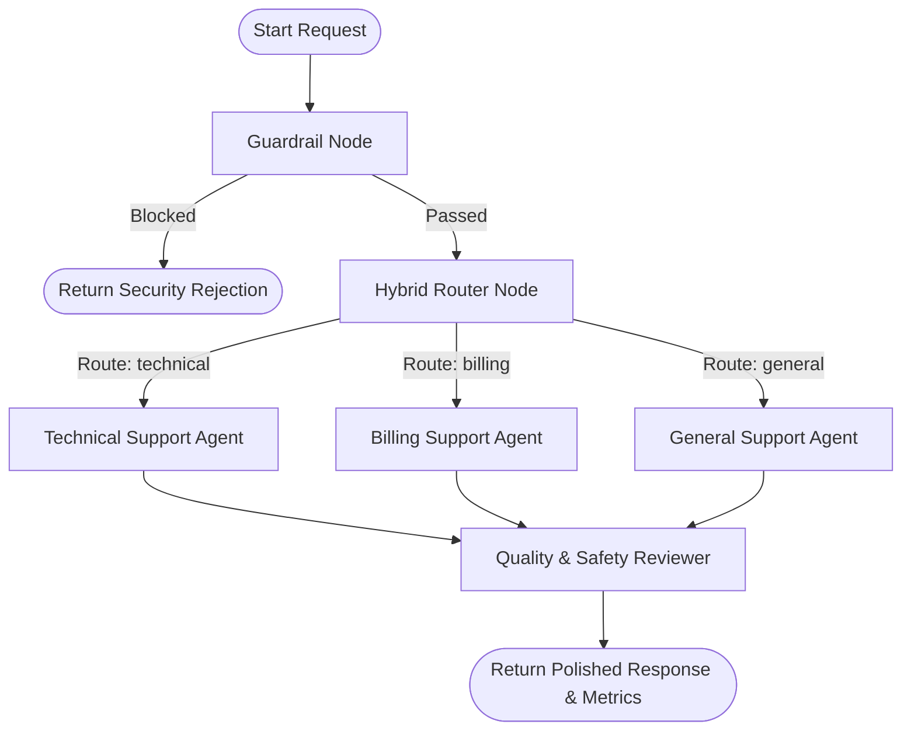

# 🛡️ Harness Engineering in Agentic AI

[](https://www.python.org/downloads/)
[](https://fastapi.tiangolo.com/)
[](https://langchain-ai.github.io/langgraph/)
[](https://python.langchain.com/)
[](LICENSE)

An enterprise-grade demonstration of **Harness Engineering in Agentic AI**—a design pattern that separates Large Language Model (LLM) raw intelligence from operational control flow, guardrails, routing, and quality assurance. Built using **LangGraph**, **FastAPI**, **LangChain Groq**, and a modern web frontend, this project provides a deterministic safety harness around specialized LLM agents.

---

## 📖 Table of Contents

- [Overview & Philosophy](#-overview--philosophy)
- [Key Features](#-key-features)
- [System Architecture](#-system-architecture)
- [Pipeline Breakdown](#-pipeline-breakdown)
  - [1. Safety Guardrail Layer](#1-safety-guardrail-layer)
  - [2. Hybrid Router Node](#2-hybrid-router-node)
  - [3. Specialized Agent Nodes](#3-specialized-agent-nodes)
  - [4. Quality Reviewer Node](#4-quality-reviewer-node)
- [Repository Structure](#-repository-structure)
- [Getting Started](#-getting-started)
  - [Prerequisites](#prerequisites)
  - [Installation](#installation)
  - [Environment Configuration](#environment-configuration)
  - [Running the Application](#running-the-application)
- [API Documentation](#-api-documentation)
- [Web Interface & Telemetry](#-web-interface--telemetry)
- [Extensibility Guide](#-extensibility-guide)
- [Codebase Analysis & Roadmap](#-codebase-analysis--roadmap)
- [License](#-license)

---

## 💡 Overview & Philosophy

In production AI applications, relying entirely on raw LLM prompts for routing, security, and quality enforcement leads to latency spikes, unpredictable non-deterministic behaviors, safety leaks, and high API costs.

**Harness Engineering** introduces a structural framework where:
1. **Control Flow is Deterministic**: Routing and safety guardrails run as code execution nodes before reaching expensive LLM calls.
2. **Agents are Specialized**: LLMs are isolated into targeted domain roles (Technical, Billing, General Support) with constrained system prompts and Pydantic output schemas.
3. **Quality is Audited**: Outputs pass through an evaluation and validation node before reaching the end user.
4. **Telemetry is First-Class**: Step-by-step latency, confidence scores, and node execution traces are monitored per request.

```
                  ┌───────────────────────────────┐
                  │          User Request         │
                  └───────────────┬───────────────┘
                                  │
                                  ▼
                  ┌───────────────────────────────┐
                  │      Guardrail Node 🛡️        │
                  │   (Regex & Security Checks)   │
                  └───────────────┬───────────────┘
                                  │
                       Blocked? ──┴── Passed?
                          │              │
                          ▼              ▼
                   ┌──────────┐  ┌────────────────┐
                   │ Rejected │  │ Hybrid Router  │
                   └──────────┘  └───────┬────────┘
                                         │
               ┌─────────────────────────┼─────────────────────────┐
               ▼                         ▼                         ▼
    ┌────────────────────┐    ┌────────────────────┐    ┌────────────────────┐
    │ Technical Agent 💻 │    │  Billing Agent 💳  │    │  General Agent 💬  │
    └─────────┬──────────┘    └─────────┬──────────┘    └─────────┬──────────┘
              │                         │                         │
              └─────────────────────────┼─────────────────────────┘
                                        │
                                        ▼
                            ┌───────────────────────┐
                            │  Reviewer Agent ⚖️    │
                            │ (Quality & Safety Check)│
                            └───────────┬───────────┘
                                        │
                                        ▼
                            ┌───────────────────────┐
                            │    Final Response     │
                            └───────────────────────┘
```

---

## ✨ Key Features

- **⚡ Async Non-Blocking Pipeline**: Fully asynchronous state graph (`ainvoke`) integrated into FastAPI ASGI event loops for high throughput.
- **🛡️ Multi-Layer Security Guardrails**: Instant rejection of sensitive requests (password leaks, credit card regex patterns `\b(?:\d[ -]*?){13,16}\b`, credential bypasses).
- **🔀 Hybrid Routing Mechanism**: 
  - *Fast Path*: Sub-millisecond keyword matching for unambiguous queries.
  - *Fallback Path*: Structured JSON-mode LLM classification via `ChatGroq` for ambiguous queries.
- **🎯 Structured Output Enforcement**: Uses Pydantic schemas (`RouterDecision`, `AgentDraftResponse`, `ReviewResult`) and `JsonOutputParser` to eliminate unstructured formatting errors.
- **⚖️ Automated Quality Reviewer**: Validates clarity, safety, and policy compliance, returning quality metrics and polished responses.
- **📊 Granular Latency Telemetry**: Captures per-node execution times (`latency_ms`) and human-readable execution step logs.
- **🖥️ Interactive Web Console**: Modern, responsive dark-themed UI featuring prompt chips, real-time trace visualizers, metric badges, and instant execution feedback.

---

## 🏗️ System Architecture

The core state graph is implemented using **LangGraph** in [`graph.py`](graph.py). State transitions are governed by a shared `SupportState` data dictionary:

```python
class NodeMetric(TypedDict):
    node: str
    latency_ms: float
    mode: str
    details: str

class SupportState(TypedDict):
    question: str
    route: str
    route_mode: str         # "deterministic" | "llm_fallback"
    route_confidence: float
    draft: str
    final_answer: str
    blocked: bool
    quality_score: float
    node_metrics: list[NodeMetric]
    trace: list[str]
```

### LangGraph Workflow Diagram



---

## 🔍 Pipeline Breakdown

### 1. Safety Guardrail Layer
- **File**: [`graph.py`](graph.py) (`guardrail_node`)
- **Execution**: Deterministic (0 ms latency cost)
- **Function**: Scans inputs against illegal pattern lists (password theft, credentials, security bypasses) and evaluates regular expressions for credit card numbers.
- **Action**: If triggered, short-circuits the pipeline immediately, setting `"blocked": True` and skipping all downstream LLM calls.

### 2. Hybrid Router Node
- **File**: [`graph.py`](graph.py) (`router_node`) & [`agents.py`](agents.py) (`llm_router_async`)
- **Execution**: Dual-Mode (Deterministic Fast-Path + LLM Fallback)
- **Function**:
  1. Checks for unambiguous technical terms (`error`, `bug`, `api`, `stacktrace`) or billing terms (`pricing`, `refund`, `invoice`, `subscription`).
  2. If keyword matching is ambiguous (or contains overlapping categories), invokes the async LLM fallback classifier returning a structured `RouterDecision`.

### 3. Specialized Agent Nodes
- **File**: [`agents.py`](agents.py) & [`graph.py`](graph.py)
- **Execution**: Async LLM with JSON Mode
- **Agents**:
  - **Technical Agent** (`technical_agent_async`): Handles login errors, code bugs, installation, and API issues.
  - **Billing Agent** (`billing_agent_async`): Enforces company pricing policies ($10 Starter, $25 Pro) and refund disclaimers.
  - **General Agent** (`general_agent_async`): Manages general inquiries with polite guidance.
- **Output Schema**: `AgentDraftResponse` containing `draft`, `key_points`, and `requires_escalation`.

### 4. Quality Reviewer Node
- **File**: [`agents.py`](agents.py) (`reviewer_agent_async`) & [`graph.py`](graph.py) (`reviewer_node`)
- **Execution**: Async Structured Validation
- **Function**: Audits the generated draft against clarity, friendly tone, safety rules, and policy compliance. Outputs a `quality_score` (0.0 - 1.0) and the final polished answer.

---

## 📁 Repository Structure

```text
harness-engineering/
├── agents.py                     # Specialist agent prompts, Pydantic models & async LLM invocations
├── app.py                        # FastAPI server, web routes & error handling endpoints
├── graph.py                      # LangGraph state machine, guardrails, hybrid router & node graph
├── main.py                       # CLI entry point script
├── project_analysis_and_rating.md# Detailed codebase evaluation, rating & architecture report
├── pyproject.toml                # Project metadata & dependency declarations (uv compatible)
├── requirements.txt              # Pip dependencies list
├── README.md                     # Project documentation & architecture overview
├── LICENSE                       # MIT License
├── static/
│   ├── script.js                 # UI event handling, async fetch & DOM updating logic
│   └── style.css                 # Dark-themed dashboard styling & animations
└── templates/
    └── index.html                # Main web interface template (Jinja2)
```

---

## 🚀 Getting Started

### Prerequisites

- **Python**: `3.11` or higher (Python 3.13 tested)
- **Groq API Key**: Free API key from [Groq Console](https://console.groq.com/)

### Installation

1. **Clone the Repository**:
   ```bash
   git clone https://github.com/AbhaySingh71/Advance-ai-infrastructure.git
   cd harness-engineering
   ```

2. **Create & Activate Virtual Environment**:
   *Using Conda:*
   ```bash
   conda create -n harness-env python=3.11 -y
   conda activate harness-env
   ```
   *Using venv:*
   ```bash
   python -m venv .venv
   # Windows:
   .venv\Scripts\activate
   # Linux/macOS:
   source .venv/bin/activate
   ```

3. **Install Dependencies**:
   ```bash
   pip install -r requirements.txt
   ```
   *Or using `uv`:*
   ```bash
   uv sync
   ```

### Environment Configuration

Create a `.env` file in the root directory:

```env
GROQ_API_KEY=your_groq_api_key_here
```

---

## 🖥️ Running the Application

### Option A: Web Server (Recommended)

Launch the FastAPI application with Uvicorn:

```bash
python app.py
```
*Or directly via Uvicorn:*
```bash
uvicorn app:app --reload --port 8080
```

Open your browser and navigate to: **`http://localhost:8080`**

### Option B: Command Line Interface (CLI)

Run the CLI main entry point:

```bash
python main.py
```

---

## 📡 API Documentation

### POST `/api/chat`

Executes the support harness pipeline for a given customer question.

#### Request Body
```json
{
  "message": "I was double charged $25 for my Pro subscription plan."
}
```

#### Response Payload (`200 OK`)
```json
{
  "route": "billing",
  "route_mode": "deterministic",
  "route_confidence": 1.0,
  "answer": "Thank you for reaching out regarding your Pro subscription payment. Our Pro plan is priced at $25/month. If you notice duplicate charges, please allow our billing team to review your transactions. Refunds are carefully evaluated by our specialized team. We're here to assist you!",
  "blocked": false,
  "quality_score": 0.95,
  "total_latency_ms": 1240.5,
  "node_metrics": [
    {
      "node": "Guardrail",
      "latency_ms": 0.12,
      "mode": "deterministic",
      "details": "Passed safety checks"
    },
    {
      "node": "Router",
      "latency_ms": 0.08,
      "mode": "deterministic",
      "details": "Routed to billing (100%) via Deterministic"
    },
    {
      "node": "Billing Agent",
      "latency_ms": 680.25,
      "mode": "structured_llm",
      "details": "Draft generated with 2 key points"
    },
    {
      "node": "Reviewer Agent",
      "latency_ms": 560.05,
      "mode": "structured_validation",
      "details": "Score: 0.95 | Approved: True"
    }
  ],
  "trace": [
    "[Guardrail] Passed safety checks in 0.12ms",
    "[Router (Deterministic)] Selected 'billing' (Confidence: 100%) - Unambiguous keyword match (charged, subscription, plan) in 0.08ms",
    "[Billing Agent] Draft generated in 680.25ms",
    "[Reviewer Agent] Validated response (Quality Score: 95%) - Verified clarity and policy alignment in 560.05ms"
  ]
}
```

#### Rejection Response (`Guardrail Blocked`)
```json
{
  "route": "blocked",
  "route_mode": "deterministic",
  "route_confidence": 1.0,
  "answer": "Request Blocked: I cannot fulfill requests involving passwords, stolen credentials, full payment card numbers, or security bypasses.",
  "blocked": true,
  "quality_score": 0.0,
  "total_latency_ms": 0.15,
  "node_metrics": [
    {
      "node": "Guardrail",
      "latency_ms": 0.15,
      "mode": "deterministic",
      "details": "Blocked unsafe request"
    }
  ],
  "trace": [
    "[Guardrail] BLOCKED request - Safety violation detected in 0.15ms"
  ]
}
```

---

## 📊 Web Interface & Telemetry

The interactive console provides comprehensive visual feedback:

1. **Preset Prompt Chips**: Instant testing for Technical, Billing, General, and Unsafe queries.
2. **Metrics Dashboard**: Displays Total Latency (ms), Target Route, Routing Mode (Deterministic vs. LLM Fallback), and Quality Score.
3. **Execution Trace Log**: Live terminal-style breakdown showing timestamps, step details, and pipeline decisions.
4. **Node Performance Breakdown**: Visual card components displaying timing metrics for every individual node.

---

## 🔧 Extensibility Guide

### 1. Adding Custom Guardrail Rules
Edit `guardrail_node` in [`graph.py`](graph.py) to add custom keyword lists or regex patterns:

```python
# Example: Adding PII Social Security Number (SSN) Regex
ssn_pattern = r"\b\d{3}-\d{2}-\d{4}\b"
if re.search(ssn_pattern, state["question"]):
    return {"blocked": True, "final_answer": "Request Blocked: SSN detected."}
```

### 2. Adding a New Specialist Agent
1. Define your agent prompt function in [`agents.py`](agents.py):
   ```python
   async def analytics_agent_async(question: str) -> AgentDraftResponse: ...
   ```
2. Add the corresponding node in [`graph.py`](graph.py):
   ```python
   builder.add_node("analytics_agent", analytics_node)
   ```
3. Update `choose_agent` conditional edge mapping.

### 3. Changing LLM Models
Modify `MODEL_NAME` in [`agents.py`](agents.py):
```python
MODEL_NAME = "llama-3.3-70b-versatile"  # Or any supported Groq model identifier
```

---

## 📈 Codebase Analysis & Roadmap

For an in-depth code rating, vulnerability audit, and production readiness roadmap, see [`project_analysis_and_rating.md`](project_analysis_and_rating.md).

### Summary of System Health Ratings
| Category | Score | Rating |
| :--- | :---: | :--- |
| **Architecture & Harness Design** | **7 / 10** | Good |
| **Safety & Guardrails** | **8 / 10** | Hardened (Regex + Lowercase matching) |
| **Routing & Logic** | **8 / 10** | Robust (Deterministic + LLM Fallback) |
| **Resilience & Async Performance** | **9 / 10** | Non-blocking ASGI Pipeline |
| **Code Quality & Maintainability** | **8 / 10** | Structured Pydantic Schemas |

---

## 📜 License

This project is licensed under the [MIT License](LICENSE).
