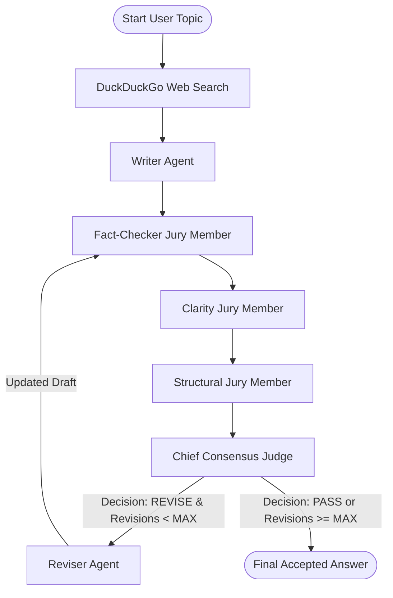

# 🔄 Loop Engineering: Multi-Aspect Jury & Web Search Loop Agent

[](https://www.python.org/downloads/)
[](https://fastapi.tiangolo.com/)
[](https://langchain-ai.github.io/langgraph/)
[](https://python.langchain.com/)
[](https://pypi.org/project/ddgs/)
[](LICENSE)

An enterprise-grade demonstration of **Loop Engineering in Agentic AI**—a design pattern centered on iterative self-reflection, multi-perspective jury evaluation, consensus-driven critique synthesis, and bounded self-correction loops. Built using **LangGraph**, **FastAPI**, **LangChain Groq**, **Pydantic v2**, and **DuckDuckGo Web Search**, this project guarantees factually grounded, beginner-friendly explanations with automated multi-agent quality enforcement.

---

## 📖 Table of Contents

- [Overview & Philosophy](#-overview--philosophy)
- [Key Features](#-key-features)
- [System Architecture](#-system-architecture)
- [Pipeline & Jury Breakdown](#-pipeline--jury-breakdown)
  - [1. Web Search Grounding Node](#1-web-search-grounding-node)
  - [2. Writer Node](#2-writer-node)
  - [3. Multi-Aspect Jury Panel (3 Evaluators)](#3-multi-aspect-jury-panel-3-evaluators)
  - [4. Chief Consensus Judge](#4-chief-consensus-judge)
  - [5. Bounded Reviser Node](#5-bounded-reviser-node)
- [Repository Structure](#-repository-structure)
- [Getting Started](#-getting-started)
  - [Prerequisites](#prerequisites)
  - [Installation](#installation)
  - [Environment Configuration](#environment-configuration)
  - [Running the Application](#running-the-application)
- [API Documentation](#-api-documentation)
- [Web Interface & Telemetry](#-web-interface--telemetry)
- [Extensibility & Configuration](#-extensibility--configuration)
- [Codebase Analysis & Roadmap](#-codebase-analysis--roadmap)
- [License](#-license)

---

## 💡 Overview & Philosophy

Single-shot LLM responses frequently suffer from hallucinations, jargon overload, improper formatting, or missing facts. Relying on simple prompt engineering without evaluation loops often fails when handling complex technical topics.

**Loop Engineering** solves this problem by structuring LLM execution into a **self-correcting feedback graph**:
1. **Real-Time Fact Grounding**: Web search context is fetched first to anchor all explanations in live facts rather than static training weights.
2. **Multi-Aspect Jury Evaluation**: Instead of relying on a single evaluator, a 3-member specialized jury audits the draft independently across Factual Accuracy, Pedagogical Clarity, and Structural Constraints.
3. **Consensus Synthesis**: A Chief Consensus Judge aggregates the jury's feedback into a single, prioritized Action Plan.
4. **Bounded Self-Correction Loops**: A Reviser agent refines the draft based on the Action Plan until the jury passes or the maximum revision limit (`MAX_REVISIONS`) is reached.

```
                  ┌───────────────────────────────┐
                  │          User Topic           │
                  └───────────────┬───────────────┘
                                  │
                                  ▼
                  ┌───────────────────────────────┐
                  │  DuckDuckGo Web Search Node   │
                  └───────────────┬───────────────┘
                                  │
                                  ▼
                  ┌───────────────────────────────┐
                  │         Writer Agent          │
                  └───────────────┬───────────────┘
                                  │
                                  ▼
      ┌──────────────────────────────────────────────────────┐
      │             Multi-Aspect Jury Panel ⚖️               │
      │  ┌──────────────────┬─────────────────┬───────────┐  │
      │  │ Fact Checker 🔍  │ Clarity 💡      │ Structure │  │
      │  └──────────────────┴─────────────────┴───────────┘  │
      └───────────────────────────┬──────────────────────────┘
                                  │
                                  ▼
                  ┌───────────────────────────────┐
                  │    Chief Consensus Judge      │
                  └───────────────┬───────────────┘
                                  │
                      PASS / Max Revisions? ─── REVISE?
                                  │                │
                                  │                ▼
                                  │      ┌──────────────────┐
                                  │      │  Reviser Agent   │
                                  │      └─────────┬────────┘
                                  │                │
                                  │                └────── (Loop back to Jury)
                                  ▼
                  ┌───────────────────────────────┐
                  │     Final Accepted Answer     │
                  └───────────────────────────────┘
```

---

## ✨ Key Features

- **🌐 Live Web Search Grounding**: Integrates DuckDuckGo (`ddgs`) search to inject fresh, real-time facts into prompts and evaluator checks.
- **⚖️ 3-Member Multi-Aspect Jury Panel**:
  - 🔍 **Fact-Checker Evaluator**: Audits claims against DuckDuckGo search context (`FactReview`).
  - 💡 **Pedagogy & Clarity Evaluator**: Verifies simple tone and everyday analogy quality (`ClarityReview`).
  - 📐 **Structural Evaluator**: Enforces word count budget (120–170 words), focus, and concrete examples (`StructureReview`).
- **🏛️ Chief Consensus Judge (Aggregator Node)**: Synthesizes individual jury reviews into a unified 2-bullet Action Plan (`ConsensusDecision`).
- **🔄 Bounded Self-Correction Loop**: Prevents infinite loops by capping revisions with `MAX_REVISIONS` (configurable via `.env`).
- **🎯 Pydantic Structured Outputs**: Employs `with_structured_output(...)` to ensure typed JSON responses for all evaluation nodes.
- **🖥️ Interactive Web Console**: Dark-themed dashboard rendering live search context, jury verdict badges, action plans, and complete event execution streams.

---

## 🏗️ System Architecture

The workflow is built as a state machine in [`backend.py`](backend.py) using **LangGraph**. State transitions are tracked in the `State` TypedDict:

```python
class State(TypedDict):
    topic: str
    search_context: str
    draft: str
    fact_review: dict
    clarity_review: dict
    structure_review: dict
    consensus_decision: str
    synthesized_feedback: str
    revision_count: int
```

### LangGraph State Diagram



---

## 🔍 Pipeline & Jury Breakdown

### 1. Web Search Grounding Node
- **File**: [`backend.py`](backend.py) (`web_search_node`)
- **Tool**: DuckDuckGo API (`ddgs`)
- **Function**: Queries DuckDuckGo for top web results on the user's topic and formats search snippets as structured references.

### 2. Writer Node
- **File**: [`backend.py`](backend.py) (`writer_node`)
- **Function**: Generates an initial draft strictly constrained by system requirements:
  1. Simple, beginner-friendly tone.
  2. One clear everyday analogy.
  3. One tiny concrete example.
  4. Factual grounding in web search results (120–160 words).

### 3. Multi-Aspect Jury Panel (3 Evaluators)
- **Fact-Checker Evaluator** (`fact_checker_evaluator`): Audits factual claims against search snippets. Uses `FactReview` Pydantic schema (`PASS` / `REVISE` + `feedback`).
- **Clarity Evaluator** (`clarity_evaluator`): Checks for jargon-free language and analogy effectiveness. Uses `ClarityReview` schema.
- **Structural Evaluator** (`structure_evaluator`): Verifies length budgets (120–170 words), focus, and concrete examples. Uses `StructureReview` schema.

### 4. Chief Consensus Judge
- **File**: [`backend.py`](backend.py) (`consensus_judge`)
- **Schema**: `ConsensusDecision` (`decision: PASS | REVISE`, `action_plan: str`)
- **Function**: Aggregates all 3 jury reviews. If any member flags a non-trivial issue, generates a prioritized 2-bullet Action Plan for the reviser.

### 5. Bounded Reviser Node
- **File**: [`backend.py`](backend.py) (`reviser_node`)
- **Function**: Re-writes the draft by executing the Consensus Action Plan while keeping factual context intact, then increments `revision_count`.

---

## 📁 Repository Structure

```text
loop-engineering/
├── app.py                                   # FastAPI server & /api/run web endpoint
├── backend.py                               # DuckDuckGo tool, LangGraph 7-node loop & Pydantic schemas
├── main.py                                  # CLI entry point script
├── project_analysis_and_recommendations.md  # Architectural roadmap & system analysis report
├── pyproject.toml                           # Project metadata & dependencies (uv compatible)
├── requirements.txt                         # Pip dependencies list
├── README.md                                # Detailed documentation & architecture guide
├── LICENSE                                  # MIT License
├── static/
│   ├── app.js                               # Frontend event stream rendering & jury badge UI
│   └── style.css                            # Dark-themed styling tokens & layout rules
└── templates/
    └── index.html                           # Main web UI template (Jinja2)
```

---

## 🚀 Getting Started

### Prerequisites

- **Python**: `3.11` or higher (Python 3.13 tested)
- **Groq API Key**: Free API key from [Groq Console](https://console.groq.com/)

### Installation

1. **Clone the Repository**:
   ```bash
   git clone https://github.com/AbhaySingh71/Advance-ai-infrastructure.git
   cd loop-engineering
   ```

2. **Create & Activate Virtual Environment**:
   *Using Conda:*
   ```bash
   conda create -n loop-env python=3.11 -y
   conda activate loop-env
   ```
   *Using venv:*
   ```bash
   python -m venv .venv
   # Windows:
   .venv\Scripts\activate
   # Linux/macOS:
   source .venv/bin/activate
   ```

3. **Install Dependencies**:
   ```bash
   pip install -r requirements.txt
   ```
   *Or using `uv`:*
   ```bash
   uv sync
   ```

### Environment Configuration

Create a `.env` file in the root directory:

```env
GROQ_API_KEY=your_groq_api_key_here
GROQ_MODEL=openai/gpt-oss-20b
MAX_REVISIONS=2
```

---

## 🖥️ Running the Application

### Option A: Web Server (Recommended)

Run the FastAPI web application:

```bash
python app.py
```
*Or using Uvicorn directly:*
```bash
uvicorn app:app --reload --port 8000
```

Open your browser and navigate to: **`http://127.0.0.1:8000`**

### Option B: Command Line Interface (CLI)

Run interactive CLI mode:

```bash
python backend.py
```

---

## 📡 API Documentation

### POST `/api/run`

Triggers the DuckDuckGo search and self-correcting multi-agent jury loop for a given topic.

#### Request Body
```json
{
  "topic": "What is Quantum Computing?"
}
```

#### Response Payload (`200 OK`)
```json
{
  "topic": "What is Quantum Computing?",
  "provider": "Groq",
  "model": "openai/gpt-oss-20b",
  "revision_count": 1,
  "final_decision": "PASS",
  "final_answer": "Quantum computing is a revolutionary technology that uses the principles of quantum mechanics to solve complex problems faster than classical computers...",
  "search_context": "Source [1]: Quantum Computing Explained...\nSummary: Quantum computers harness qubits...",
  "events": [
    {
      "agent": "web_search",
      "revision_count": 0,
      "search_context": "Source [1]: Quantum Computing Explained..."
    },
    {
      "agent": "writer",
      "revision_count": 0,
      "draft": "Initial draft explanation..."
    },
    {
      "agent": "fact_checker",
      "revision_count": 0,
      "fact_review": {
        "decision": "PASS",
        "feedback": "All facts match DuckDuckGo search context."
      }
    },
    {
      "agent": "clarity_evaluator",
      "revision_count": 0,
      "clarity_review": {
        "decision": "REVISE",
        "feedback": "The concept of superposition needs a simpler everyday analogy."
      }
    },
    {
      "agent": "structure_evaluator",
      "revision_count": 0,
      "structure_review": {
        "decision": "PASS",
        "feedback": "Word count is 145 words, includes concrete example."
      }
    },
    {
      "agent": "consensus_judge",
      "revision_count": 0,
      "consensus_decision": "REVISE",
      "synthesized_feedback": "1. Replace technical explanation of superposition with a spinning coin analogy.\n2. Maintain current word length."
    },
    {
      "agent": "reviser",
      "revision_count": 1,
      "draft": "Revised draft incorporating spinning coin analogy..."
    },
    {
      "agent": "fact_checker",
      "revision_count": 1,
      "fact_review": { "decision": "PASS", "feedback": "Factually accurate." }
    },
    {
      "agent": "clarity_evaluator",
      "revision_count": 1,
      "clarity_review": { "decision": "PASS", "feedback": "Analogy is clear and accessible." }
    },
    {
      "agent": "structure_evaluator",
      "revision_count": 1,
      "structure_review": { "decision": "PASS", "feedback": "Structure approved." }
    },
    {
      "agent": "consensus_judge",
      "revision_count": 1,
      "consensus_decision": "PASS",
      "synthesized_feedback": "Draft meets all quality, factual, and structural standards."
    }
  ]
}
```

---

## 📊 Web Interface & Telemetry

The interactive console renders execution details dynamically:

1. **Search Context Drawer**: Displays formatted DuckDuckGo search snippets used by the agents.
2. **Jury Panel Verdict Badges**: Shows color-coded badges (`PASS` / `REVISE`) for Fact Checker, Clarity Evaluator, and Structural Evaluator.
3. **Action Plan Cards**: Displays the synthesized instructions generated by the Chief Consensus Judge.
4. **Live Execution Timeline**: Step-by-step event history detailing every node iteration and draft revision.

---

## 🔧 Extensibility & Configuration

### Environment Variables Reference

| Variable | Default Value | Description |
| :--- | :--- | :--- |
| `GROQ_API_KEY` | *(Required)* | API Key for Groq Cloud LLM endpoint |
| `GROQ_MODEL` | `openai/gpt-oss-20b` | Model identifier used across all nodes |
| `MAX_REVISIONS` | `2` | Maximum self-correction iterations before auto-termination |

### Adding Custom Jury Members
To add a new evaluator (e.g., Tone Evaluator):
1. Define a Pydantic schema in [`backend.py`](backend.py):
   ```python
   class ToneReview(BaseModel):
       decision: Literal["PASS", "REVISE"]
       feedback: str
   ```
2. Create the node function and bind the model via `with_structured_output(ToneReview)`.
3. Add the node to `StateGraph` in [`backend.py`](backend.py) and include its output in `consensus_judge`.

---

## 📈 Codebase Analysis & Roadmap

For a detailed analysis report and future enhancements roadmap, see [`project_analysis_and_recommendations.md`](project_analysis_and_recommendations.md).

### Implemented vs. Planned Features

| Feature | Status | Details |
| :--- | :---: | :--- |
| **DuckDuckGo Web Search Grounding** | ✅ Implemented | Live context retrieval using `ddgs` |
| **Multi-Aspect Jury Panel** | ✅ Implemented | 3 specialized evaluation nodes |
| **Chief Consensus Judge** | ✅ Implemented | Aggregator node producing actionable feedback |
| **Pydantic Structured Output** | ✅ Implemented | Typed JSON schema enforcement |
| **Server-Sent Events (SSE) Streaming** | ⏳ Planned | Real-time token/node streaming |
| **Human-in-the-Loop Overrides** | ⏳ Planned | User approval step before revision |

---

## 📜 License

This project is licensed under the [MIT License](LICENSE).
