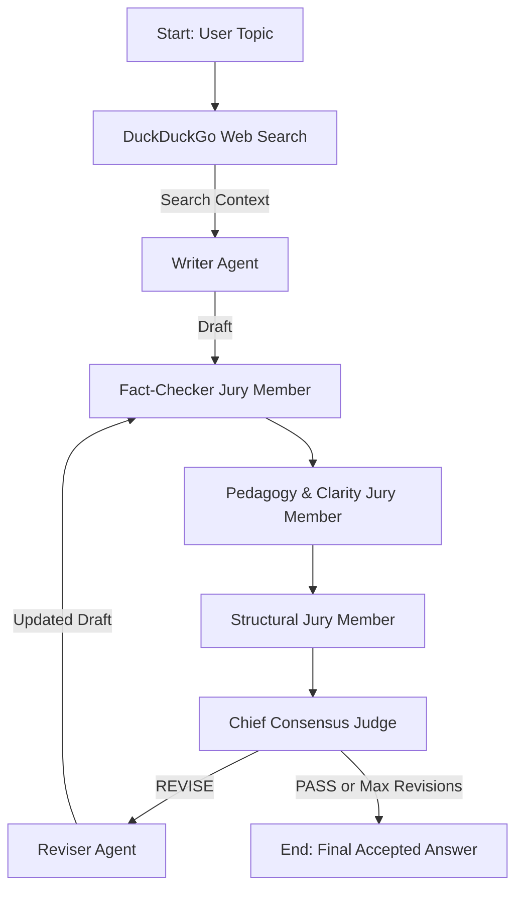

# Project Analysis & Advancement Roadmap: Loop Engineering Agent

## 1. Project Overview & Updated Architecture

`loop-engineering` is an advanced multi-agent system demonstrating **self-correcting LLM workflows with live web research and multi-aspect jury evaluation** using **FastAPI**, **LangGraph**, **LangChain**, **Groq**, and **DuckDuckGo Web Search**.

### Core Graph Workflow
The system executes a 7-node **Web Search → Writer → Jury Panel (3 Evaluators) → Consensus Judge → Reviser** graph:

### Key Components
- **[`backend.py`](file:///C:/Users/abhay/Desktop/advanced-ai-systems/loop-engineering/backend.py)**: Defines DuckDuckGo tool & `StateGraph(State)` loop powered by LangGraph:
  - **`web_search`**: Retrieves ground-truth context using DuckDuckGo (`ddgs`).
  - **`writer`**: Generates initial draft using web search context.
  - **`fact_checker`**: Evaluates factual accuracy against web search results.
  - **`clarity_evaluator`**: Evaluates beginner simplicity and analogy quality.
  - **`structure_evaluator`**: Evaluates topic focus, length budget (120–170 words), and concrete examples.
  - **`consensus_judge`**: Synthesizes feedback into a unified Action Plan & verdict (`PASS` vs `REVISE`).
  - **`reviser`**: Rewrites draft incorporating Consensus Action Plan.
- **UI Stack**: HTML5 template ([`templates/index.html`](file:///C:/Users/abhay/Desktop/advanced-ai-systems/loop-engineering/templates/index.html)), CSS styling ([`static/style.css`](file:///C:/Users/abhay/Desktop/advanced-ai-systems/loop-engineering/static/style.css)), and Javascript ([`static/app.js`](file:///C:/Users/abhay/Desktop/advanced-ai-systems/loop-engineering/static/app.js)).

---

## 2. Implemented Features & Current Status

| Feature | Status | Details |
| :--- | :--- | :--- |
| **DuckDuckGo Web Search** | ✅ **Implemented** | Live web research grounding in `web_search_node` using `ddgs`. |
| **Multi-Aspect Jury Panel** | ✅ **Implemented** | 3 specialized evaluators (`fact_checker`, `clarity_evaluator`, `structure_evaluator`). |
| **Chief Consensus Judge** | ✅ **Implemented** | Aggregator node synthesizing multi-evaluator feedback into a 2-bullet Action Plan. |
| **Updated Web UI & Trace** | ✅ **Implemented** | Interactive event cards showing web search context, jury badges, and action plans. |

---

## 3. Future Enhancements Roadmap

1. **Server-Sent Events (SSE) / WebSockets Streaming**
   - Stream node events token-by-token in real time using `graph.astream_events()`.
2. **LangGraph Checkpointing & Persistence**
   - Add `MemorySaver` or `SqliteSaver` to browse execution thread histories and pause/resume sessions.
3. **Human-in-the-Loop (HITL)**
   - Allow users to override jury verdicts or manually tweak action plans before revision starts.
4. **Multi-Model Provider Selector**
   - Allow runtime selection between Groq, OpenAI, Anthropic, and local Ollama models.

